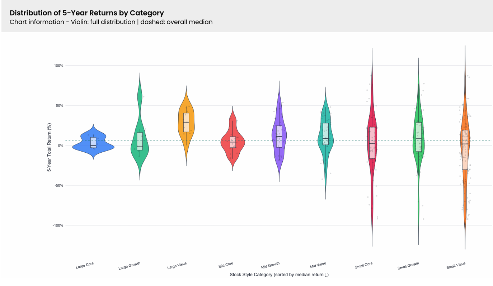

# Technology Use and Its Impact on Wellness

## Objectives of the Project

This project explores patterns in global mutual-fund performance using a dataset sourced from Morningstar. With over 500 equity funds, the dataset provides an opportunity to examine how investment style, market capitalization, geographic domicile, and industry category relate to fund returns and risk.

The analysis focuses on questions such as: Do smaller-cap funds experience greater variation in returns? Does geographic domicile influence investment style and performance? Which industries demonstrate stronger short- and long-term returns? How are risk and return related across different sectors?

 

## Analytical Insights

**1. Smaller-cap funds show greater variation in returns.**
- Small-cap Growth and Small-cap Value funds display the widest distribution of 5-year returns, indicating greater volatility and a wider range of outcomes.
- Large-cap funds, particularly Large Core and Large Value, show more concentrated returns, suggesting more consistent performance.

**2. The U.S. dominates the global mutual-fund landscape.**
- U.S.-domiciled funds make up the majority of funds across nearly every investment style.
- The distribution of funds by domicile and investment style highlights how geographic composition can influence the overall structure of investment opportunities.

**3. Industry performance varies significantly across time periods.**
- Some industries, such as Oil & Gas Equipment & Services, demonstrate consistently strong returns across multiple time periods.
- Solar shows particularly strong recent performance but considerably smaller long-term returns, suggesting that its performance has been driven more by recent gains.
- Software demonstrates relatively stable performance across the analyzed periods.

**4. Industry appears to be more informative for performance differences than market capitalization alone.**
- Energy companies are concentrated among the strongest-performing funds in the analysis, while Technology companies appear more frequently among underperformers.
- Market capitalization does not show a clear relationship with 5-year returns, suggesting that fund or company size alone does not explain performance differences.

## Conclusion

The analysis shows that mutual-fund performance is influenced by multiple factors, including investment style, geography, and industry. Smaller-cap funds tend to have greater variation in returns, while large-cap funds demonstrate more concentrated performance. Geographic domicile also shapes the composition of investment styles, with U.S.-based funds dominating the dataset.
Industry differences provide another important perspective, with certain sectors demonstrating stronger or more consistent performance across time periods. Overall, the project demonstrates how combining statistical analysis with visualizations can reveal relationships between risk, return, market structure, and industry performance that may not be immediately apparent from the raw data.
