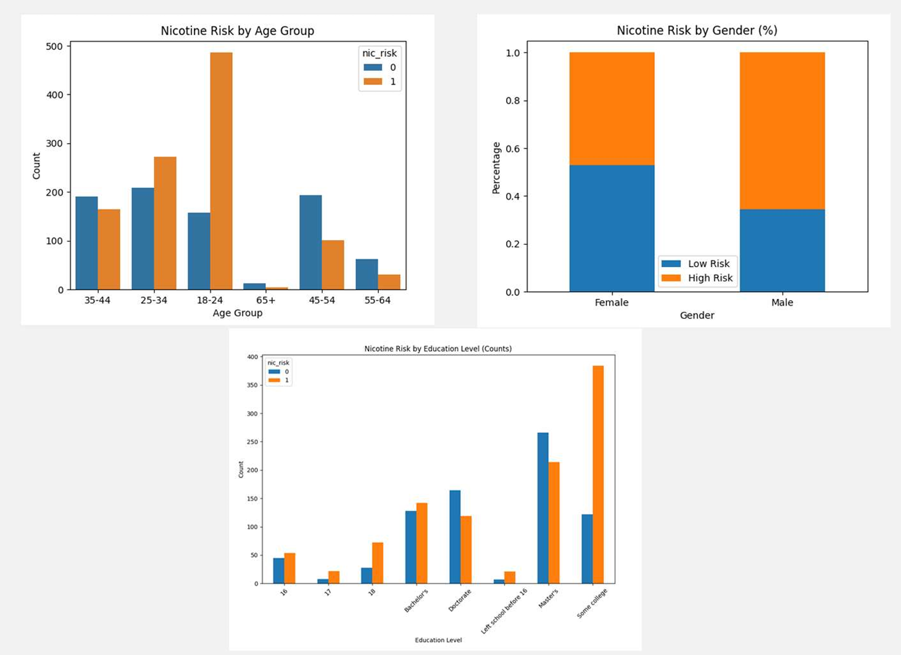

# Nicotine Dependence

## Objectives of the Project
This project explores the use of machine learning to identify patterns associated with nicotine dependence risk based on demographic, psychological, and behavioral factors. Using the Drug Consumption (Quantified) dataset containing 1,885 participants, the analysis examines how characteristics such as age, education, personality traits, impulsivity, and sensation-seeking relate to nicotine risk.

The project focuses on questions such as: Which demographic and psychological factors are associated with higher nicotine risk? How accurately can machine learning classify nicotine risk? Which classification model performs best? Which characteristics are the strongest predictors of nicotine dependence risk?

# Analytical Insights

**1. Demographic characteristics show differences in nicotine risk.**
- Younger age groups show higher proportions of high nicotine risk.
- Males have a higher proportion of high-risk nicotine use compared with females in the dataset.
- Education levels also show differences in nicotine risk, with some college education showing a relatively higher proportion of high-risk users.

**2. Several personality and behavioral traits are associated with higher nicotine risk.**

- Higher scores in neuroticism, openness, sensation-seeking, and impulsiveness are associated with increased nicotine risk.
- These patterns suggest that psychological and behavioral characteristics provide additional information beyond demographic factors when examining nicotine dependence.

**3. Random Forest provided strong predictive performance.**

- Logistic Regression, Decision Tree, and Random Forest models were evaluated using an 80/20 train-test split and 5-fold cross-validation.
- Logistic Regression achieved the highest accuracy, while Random Forest achieved the highest recall at 74.8% and the highest F1-score at 0.724.
- Because identifying individuals at risk was a primary goal of the project, Random Forest was selected for further feature-importance analysis.

**4. Personality traits were among the strongest predictors of nicotine risk.**

- Conscientiousness, openness, neuroticism, and sensation-seeking ranked among the most important features in the Random Forest model.
- Age, education, and country showed moderate importance, while gender and ethnicity had relatively low feature importance.
- Conscientiousness stood out as an especially notable predictor, with lower conscientiousness scores associated with higher nicotine risk in the exploratory analysis.

## Conclusion

The analysis demonstrates how machine learning can be used to identify patterns associated with nicotine dependence risk using demographic, psychological, and behavioral characteristics. While demographic factors such as age and education showed differences in nicotine risk, personality traits were among the strongest predictors in the final model.

Random Forest provided strong recall and F1-score performance, making it useful for identifying individuals who may be at higher risk. The findings also demonstrate how machine learning can support data-driven prevention by identifying risk patterns that could inform earlier screening, targeted education, and personalized support. Future work could incorporate larger and more current datasets to further evaluate the model and determine whether these approaches can contribute to reducing nicotine dependence over time.

