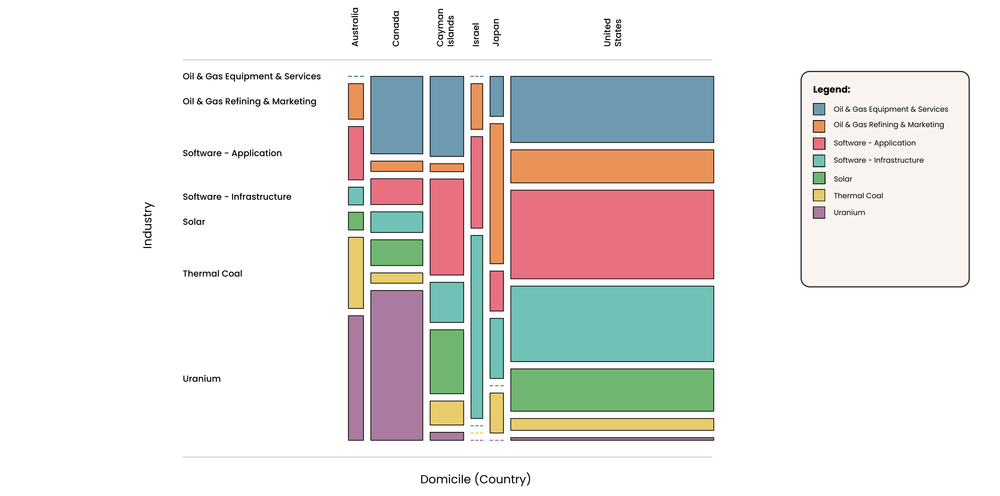

# Data Projects
 

## Technology Use and Its Impact on Wellness

## Birthing-Friendly Hospitals Across US

## Beyong Market Size
### How Company Scale and Style Influence Financial Returns and Growth
| | |
|---|---|
| | |  |
|  |  |
