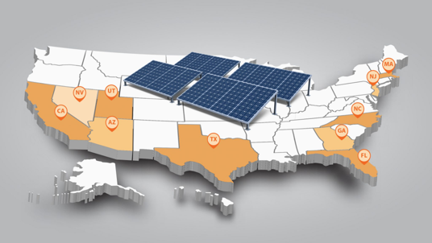
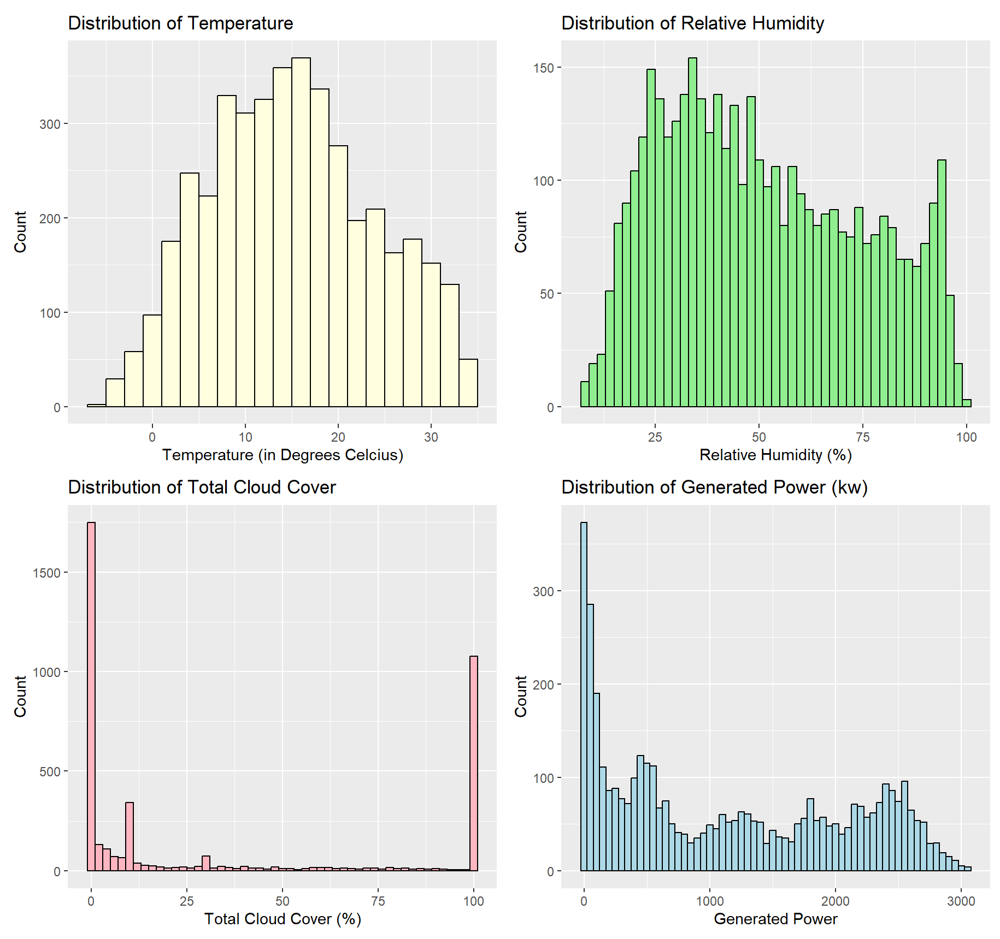
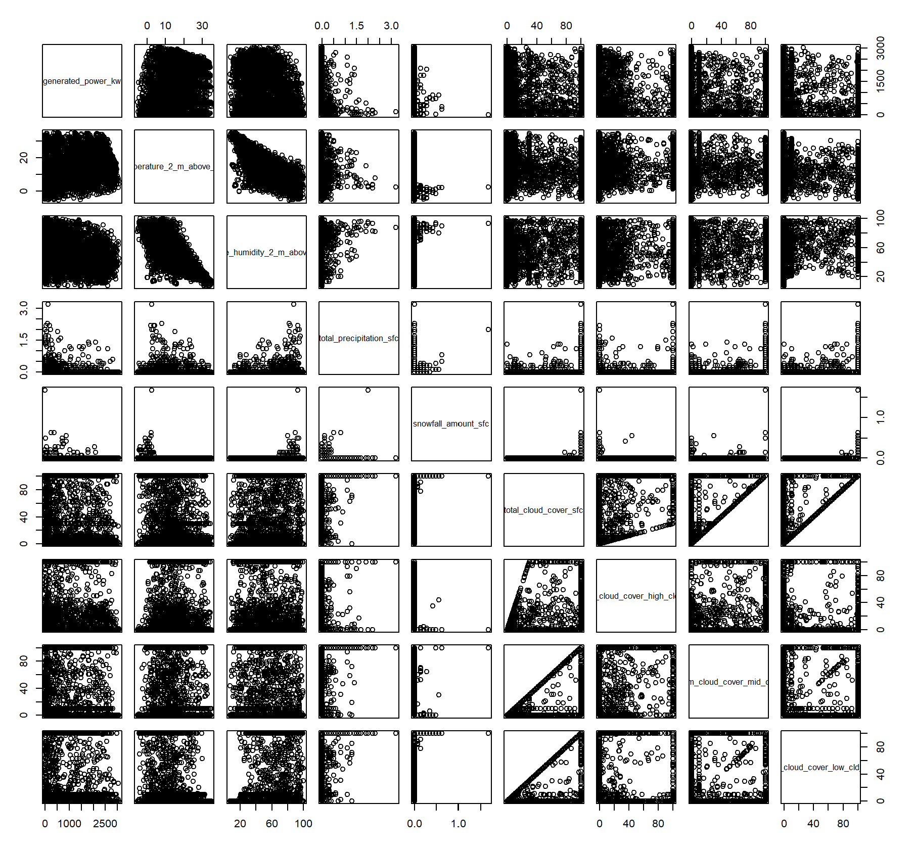
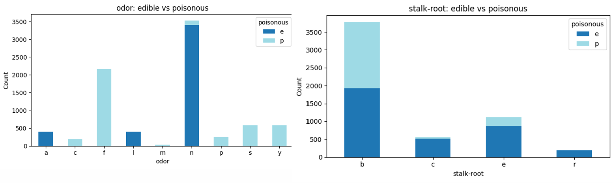

# Data Projects
 

## Technology Use and Its Impact on Wellness

## Birthing-Friendly Hospitals Across US

## Beyong Market Size
### How Company Scale and Style Influence Financial Returns and Growth

  

| | |
|---|---|
|  |  |

## Machine Learning on Poisonous Vs Nonpoisonous Mushrooms

 

Machine learning classification project predicting whether mushrooms are **poisonous or edible** using physical characteristics from the UCI Mushroom Dataset.

I compared multiple classification algorithms—including **Decision Trees, Random Forest, Gradient Boosting, Support Vector Classification, and Logistic Regression**—and evaluated their performance using accuracy and recall. Because incorrectly classifying a poisonous mushroom as edible represents a high-cost false negative, recall was treated as a key evaluation metric.

The project includes **data preprocessing, one-hot encoding, train/test splitting, 5-fold cross-validation, hyperparameter tuning, model complexity analysis, and feature importance analysis**. Several models achieved 100% accuracy and recall, with **odor-related characteristics consistently emerging as important predictors**.

**Skills:** Python · Pandas · Scikit-learn · Exploratory Data Analysis · Data Preprocessing · Classification · Hyperparameter Tuning · Cross-Validation · Model Evaluation · Feature Importance

## Using Machine Learning to Predict Nicotine Dependence Based on Psychological and Demographic Factors
