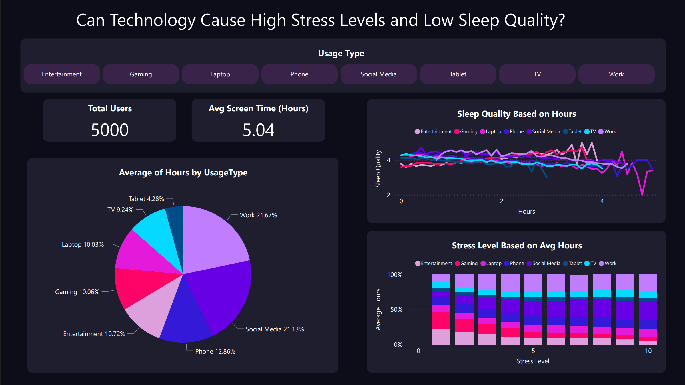

# Technology Use and Its Impact on Sleep and Stress

## About the Dataset

This dataset explores the connections between how people use technology in their daily lives and their overall well-being. It brings together information on screen time, social media and entertainment habits, sleep patterns, lifestyle choices, and different indicators of mental health such as mood, stress, anxiety, and depression.

The data offers a broad look at how digital behaviors—like time spent on phones, laptops, or social media—intersect with key aspects of wellness including sleep quality, physical activity, and mindfulness practices. Alongside these, lifestyle elements such as healthy eating and caffeine consumption are also included, allowing for a more holistic view of modern life.

## Objectives of the Project

With 5,000 participants, the dataset provides a rich opportunity to study patterns and relationships between technology use and wellness outcomes. Researchers and data scientists can use it to ask questions like: Does heavy screen time impact sleep and stress levels? Is social media linked to mood or anxiety? Can healthy habits offset the negative effects of technology use?

## Analytical Insights

**1. **
**2. **
**3. **
**4. **
**5. **

## Managerial Aspects

